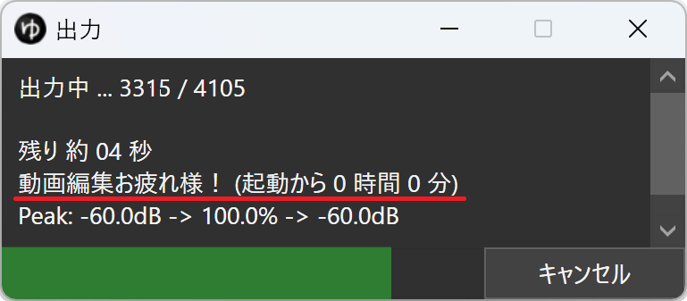

# 動画出力メッセージ-YMM4プラグイン

## 概要
動画出力ウィンドウにメッセージやYMM4の起動時間を表示するプラグイン
#### 使用例


## 導入方法
### [最新バージョンをダウンロード](https://github.com/tetra-te/VideoOutputMessage/releases/latest)
ダウンロードしたファイルをダブルクリックして、表示される画面にしたがってインストールしてください。
> [!NOTE]
> ファイルをダブルクリックしてもインストールできない場合は、YMM4を起動して`ヘルプ(H)`>`YMM4用拡張子の関連付け`>`登録する`から拡張子の関連付けを行ってください。
> 再度ファイルをダブルクリックすることでインストール画面が表示されます。

## 設定方法
1. YMM4を起動する
2. `ヘルプ(H)`>`その他`>`プラグインフォルダを開く`をクリックする
3. `VideoOutputMessage`という名前のフォルダを開く
4. フォルダの中の`Message.txt`と`ShowStartupTime.txt`を編集する（編集方法は後述）
5. YMM4を再起動する

> [!IMPORTANT]
> YMM4を再起動しないと設定が反映されません。

### Message.txt
動画出力ウィンドウに表示するメッセージを記述してください。  
メッセージは改行をせず、20文字程度に収めることを推奨します。  
デフォルトでは空になっています。
##### 記述例
```
動画編集お疲れ様！！！
```

### ShowStartupTime.txt
動画出力ウィンドウにYMM4が起動してからの時間を表示するか設定します。  
半角数字で`1`と記述すると表示、`0`と記述すると非表示です。  
デフォルトでは`1`になっています。
##### 記述例
```
1
```

## アンインストール方法
1. YMM4を起動して`ヘルプ(H)`>`その他`>`プラグインフォルダを開く`をクリックする。
2. YMM4を終了する。
3. `VideoOutputMessage`という名前のフォルダを削除する。

## ライセンス
[MIT License](./LICENSE)

## 使用ライブラリ
[Harmony](https://github.com/pardeike/Harmony)  
Harmonyのライセンスについては[licenses/Harmony.txt](licenses/Harmony.txt)を参照してください。
